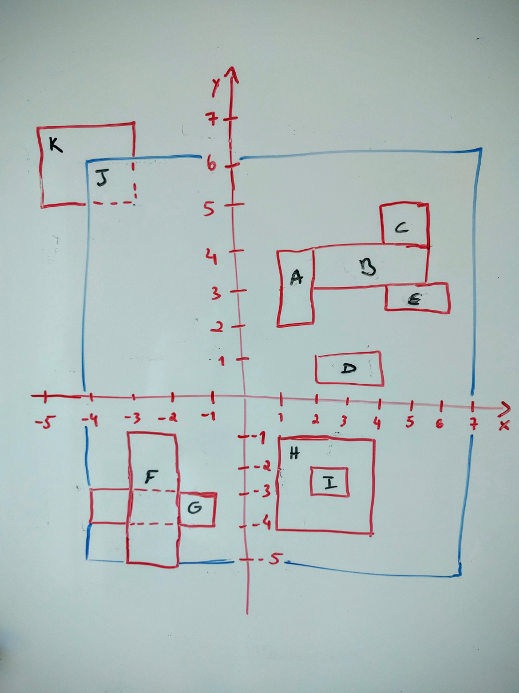

# go-dojo-rectangles

This application loads rectangular polygons from a JSON file and prints the result of the following computations:
* Intersection
* Containment
* Adjacency

## Usage

This repository already provides executables for Linux, MacOS and Windows in the `binaries` folder. So,
if you're running Windows 64-bit, you should execute:
```
./binaries/rectangles_win64 -json testdata/valid.json
```

## Build

If you want to compile this application code, you'll need to [install Go](https://golang.org/doc/install), and the following dependencies:
```
go get github.com/olekukonko/tablewriter
```

Choose one from above and proceed to build:
```
GOOS=windows GOARCH=386 go build -o binaries/rectangles_win32.exe -ldflags '-w -extldflags=-static'
GOOS=windows GOARCH=amd64 go build -o binaries/rectangles_win64.exe -ldflags '-w -extldflags=-static'
GOOS=darwin GOARCH=amd64 go build -o binaries/rectangles_mac -ldflags '-w -extldflags=-static'
GOOS=linux GOARCH=386 go build -o binaries/rectangles_lin32 -ldflags '-w -extldflags=-static'
GOOS=linux GOARCH=amd64 go build -o binaries/rectangles_lin64 -ldflags '-w -extldflags=-static'
```

You can now jump to [Usage](#usage) or run it directly:
```
go run main.go -json testdata/valid.json
```

## Tests

Package `rectangle` tests feed from `testdata/valid.json` file, which contains rectangles as depicted below.
You should use the image for an easier understanding of said tests.



The aforementioned package **has 100% test coverage**.
